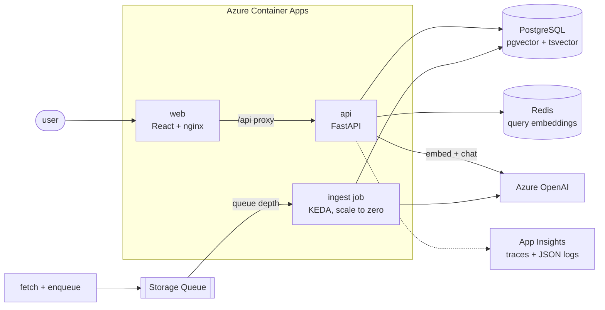

# Sift

Ask a question about an internet standard and get an answer that cites the exact section
it came from, from a corpus of 1,671 IETF RFCs.

The interesting part of this project is not that it answers questions. It is that every
claim it makes about itself is measured, and the measurements are kept even when they
are unflattering - the retrieval configuration that looked best on a small corpus lost
40% of its recall on the full one, and that is
[written down](eval/results/README.md#the-headline-result-these-numbers-do-not-survive-the-full-corpus)
rather than quietly fixed.

```
Q: Is the Host header still mandatory?

  → Searched the corpus: "Host header mandatory"
  → Followed the supersession chain: RFC 2616
  → Read a section verbatim: RFC 9110 §7.2

  Yes. A user agent MUST generate a Host header field in a request unless it
  sends that information as the ":authority" pseudo-header field (HTTP/2 and
  HTTP/3). A server MUST respond with 400 to an HTTP/1.1 request lacking one.

  Sources: RFC 9110 Section 7.2
  time 5.4s · tool calls 3 · tokens 7,024 · cost $0.0030
```

## Why RFCs

They are a genuinely hard retrieval target, which is the point. There are 9,800 of them,
they supersede each other in chains (RFC 2616 → 7230-7235 → 9110), they repeat
themselves across documents, and the answer to a question about a specification is
usually in the document that *replaced* the one the question names. A system that looks
good on a corpus of blog posts will not survive them.

## Architecture



Ingestion is a separate service behind a queue rather than an endpoint on the API: a
full corpus rebuild is 158,000 embeddings, and it must not compete with serving. The
job scales to zero and KEDA starts it on queue depth, so it costs nothing at rest.

## How an answer gets made

1. **Retrieval** is hybrid: pgvector cosine similarity over `halfvec` embeddings, fused
   with a Postgres `tsvector` search by weighted Reciprocal Rank Fusion.
2. Because `ts_rank_cd` has no IDF term, query lexemes appearing in more than 5% of
   chunks are dropped before ranking. Finding this
   [lifted recall@1 by 30% and MRR by 16%](eval/results/README.md#root-cause-ts_rank_cd-has-no-idf-and-it-shows-at-scale);
   recall@10 did not move at all, which is what identified it as a ranking problem
   rather than a retrieval one.
3. Results are diversified with per-document and per-section caps, because one RFC
   monopolising the top 10 was the largest measured failure mode.
4. **The agent** then works over four tools - search, metadata, read-a-section, and
   resolve-the-current-spec - so it can notice a hit is obsolete, walk the supersession
   graph, and answer from the successor.
5. Guardrails are enforced in the loop, not requested in the prompt: a depth cap, a tool
   budget, and an answer with no citation gets exactly one chance to be rewritten.

## Results

Retrieval, on 1,671 documents / 158,205 chunks ([full history](eval/results/README.md)):

| | recall@1 | recall@5 | recall@10 | MRR | nDCG@10 |
|---|---|---|---|---|---|
| first full-corpus run | 0.2596 | 0.5000 | 0.5769 | 0.3875 | 0.4248 |
| + IDF keyword selection | 0.3365 | 0.5192 | 0.5769 | 0.4489 | 0.4641 |
| + corrected labels, 222 load-bearing docs | 0.4423 | 0.7500 | 0.7788 | 0.6060 | 0.6408 |
| + result diversification | 0.4423 | 0.7500 | **0.7885** | 0.6222 | 0.6761 |

The second-largest gain in that table came from fixing the labels rather than the
retriever. Factual questions went from 0.5455 to 1.0000 recall@5 in that step alone.

Answers, 60 questions, judged by a separate model ([detail](eval/results/ANSWERS.md)):

| | |
|---|---|
| judged correct | 0.7833 |
| cited a labelled section | 0.5577 |
| **asserted anything without citing it** | **0.0000** |
| abstained on unanswerable questions | 8 of 8 |
| cost per question | $0.0026 |

Three caveats that belong next to those numbers rather than in a footnote. Run-to-run
spread on an unchanged configuration is 0.033, so nothing smaller than that is a result
and the judged figure above sits inside a 0.7333-0.7833 band across runs. Judged
correctness exceeding grounding is mostly the labels: `relevant` lists sections
*sufficient* to answer, not every section it is *acceptable* to cite. And the zero is
the only number here that has never moved - five runs, no answer that asserted anything
without citing it.

Latency, local ([detail](load/README.md)):

| | p50 | p95 | p99 |
|---|---|---|---|
| `/api/search` | 1.19 s | 1.74 s | 1.90 s |
| `/api/ask` | 3.81 s | 11.23 s | - |

And the number none of those percentiles contain: the deployed API runs at
`minReplicas: 0`, and the first request after it has scaled to zero takes
**25.3 seconds**. A steady-state load test never sees it, because the test keeps the
replica alive. It is a cost decision rather than a technical one - a warm replica costs
money on a student subscription - and it is
[written down](load/README.md#cold-start-25-seconds) rather than left for a visitor to
discover.

## What the numbers cost to believe

Most of the work on this project was not making it better. It was finding out that it
was not as good as the previous measurement said.

- A retrieval configuration tuned on a 33-document corpus lost 40% of its recall on the
  full one. Relative comparisons survived the move; absolute values did not.
- 18 of 21 apparent top-10 failures were *measurement* error - labels pointing at RFC
  8446 after RFC 9846 obsoleted it, so correct retrieval scored zero.
- One of those stale labels survived into the answer evaluation and was only caught
  when the judge marked a correct answer wrong. `validate_golden` now checks reference
  answers as well as labels.
- Every nDCG in the results file was wrong once. They were recomputed from stored
  relevance arrays rather than withdrawn.
- Adding 222 load-bearing documents cost 9 points of recall@10 on the 34 questions that
  did not need them.

## Running it

```bash
cp .env.example .env          # defaults run everything locally, no cloud account
docker compose up -d          # postgres + pgvector, redis, azurite

# fetch the RFCs the golden set needs, then ingest just those
python -m apps.worker.fetch_corpus --rfc $(python -m eval.golden_set --rfcs)
python -m apps.worker.ingest --sweep-corpus --activate

uvicorn apps.api.main:app --reload    # :8000
cd apps/web && pnpm install && pnpm dev   # :5173
```

`docker compose --profile app up --build` runs the containers instead of the host
processes. Without Azure credentials the whole retrieval path works on local ONNX
embeddings; `/api/ask` returns 503 and says why.

## Testing and deployment

243 Python tests and 68 React tests. CI runs `ruff`, `mypy --strict`, and pytest against
a real pgvector container - mocking the database would test the mock - plus eslint with
`jsx-a11y` at strict, where an accessibility regression fails the build.

Deployment is a local script rather than a CI job, and that is a constraint rather than
a preference: the Entra tenant this subscription lives in sets `allowedToCreateApps:
false`, so there is no service principal and no OIDC credential for Actions to
authenticate with. CI publishes SHA-tagged images to GHCR; `scripts/deploy.sh <sha>`
rolls them out and refuses to report success until `/health` answers.

Infrastructure is [one Bicep file](infra/main.bicep): Container Apps, PostgreSQL
Flexible Server, Storage Queue, Redis, Log Analytics and Application Insights, sized
throughout for a student subscription's $100 ceiling.

## Accessibility

WCAG 2.1 AA, enforced in CI three ways: `jsx-a11y` at strict, an axe-core audit over the
rendered tree in five states, and a contrast check over every token pair in both themes.
Skip link, a `/` shortcut that refuses to hijack while you are typing, one visible focus
ring that is never suppressed, and a full dark theme built from tokens.

axe found nothing. The contrast audit found four real failures that had shipped - the
trajectory and cost lines at 3.59:1 against a required 4.5:1, and the search input's own
border at 1.61:1 against a required 3:1 - none of which jsx-a11y could see and none of
which were visible to anyone looking at the page. They were found by computing them.
[What was fixed, and what is still untested](docs/accessibility.md), including the
honest gap: no manual screen-reader pass has been run.

The streaming answer is deliberately *not* a live region - announcing an answer token by
token is unusable with a screen reader, so a single status message announces it once it
settles.

## Layout

| | |
|---|---|
| `packages/sift_core` | chunking, retrieval, the agent loop, tools, providers |
| `apps/api` | FastAPI: search, SSE answers, health and readiness |
| `apps/web` | React 19 + TypeScript, no UI framework |
| `apps/worker` | corpus fetch, queue producer, queue consumer |
| `eval` | golden set, retrieval harness, answer harness, judge, sweeps |
| `load` | k6 profiles |
| `infra`, `scripts` | Bicep and the release script |
